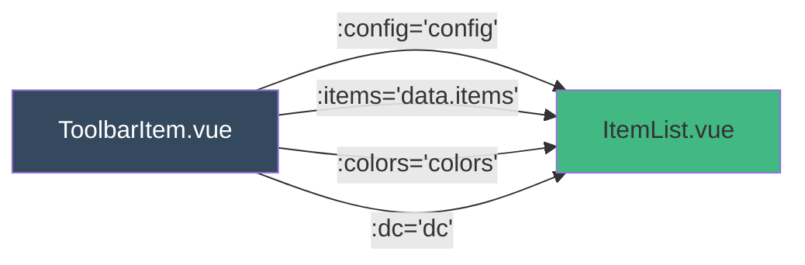
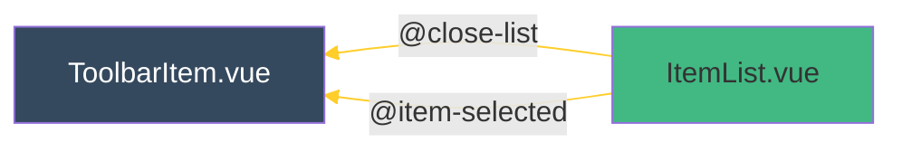

- use to render expanded tools when click expand icon on [ToolbarItem.vue](tutorial-ToolbarItem-vue.html) component
<script src="./jsdoc-tuts-mermaid.js"></script>

### parent component
[ToolbarItem.vue](tutorial-ToolbarItem-vue.html)

### child component
`None`

### state variable
`None`

### props injected from parent

|name|type|pass to child|
|--|--|--|
|config|Object||
|items|Array||
|colors|Object||
|dc|Object||

### event emitted


|event name|purpose|
|--|--|
|'item-selected'| pass selected value `item` in `items` props back to [ToolbarItem.vue](tutorial-ToolbarItem-vue.html)|
'close-list'|close expand menu when click somewhere else on the window|

```html

<template>
    <div class="tvjs-item-list" :style="list_style()" @mousedown="thismousedown">
        <div v-for="item of items" :class="item_class(item)"
            v-if="!item.hidden" @click="e => item_click(e, item)"
                :style="item_style(item)">
            <div class="trading-vue-tbicon tvjs-pixelated"
                :style="icon_style(item)">
            </div>
            <div>{{item.type}}</div>
        </div>
    </div>
</template>

<script setup>
/**
 * @component ItemList
 * @desc show all sub tools when click arrow, when expanding tool bar
 */
import { onMounted, onUnmounted, defineProps } from 'vue';

/**
 * props received from parent (ToolbarItem.Vue)
 * @constant props
 * @version 3
 */
const props = defineProps({
    config:Object,
    items:Array,
    colors:Object,
    dc:Object
})

/**
 * emit event back to parent (ToolbarItem.Vue)
 * @function emitEvent
 */
const emit = defineEmits(['item-selected', 'close-list']);


// methods
/**
 * @function list_style
 * @desc set css style over extended menu
 */
const list_style = () => {
    let w = props.config.TOOLBAR
    let brd = props.colors.tbListBorder || props.colors.grid
    let bstl = `1px solid ${brd}`
    return {
        left: `${w}px`,
        background: props.colors.back,
        borderTop: bstl,
        borderRight: bstl,
        borderBottom: bstl,
    }
}

/**
 * @function item_class
 * @desc set css class over extended menu
 * @param item 
 */
const item_class = (item) => {
    if (props.dc.tool === item.type) {
        return "tvjs-item-list-item selected-item"
    }
    return "tvjs-item-list-item"
}

/**
 * @function item_style
 * @desc set css over sub icon, height + color
 * @param item 
 */
const item_style = (item) => {
    let h = props.config.TB_ICON + props.config.TB_ITEM_M * 2 + 8
    let sel = props.dc.tool === item.type
    return {
        height: `${h}px`,
        color: sel ? undefined : `#888888`
    }
}

/**
 * @function icon_style
 * @desc set css on each icon, img, width, etc.
 * @param item 
 */
const icon_style = (data) => {
    let br = props.config.TB_ICON_BRI
    let im = props.config.TB_ITEM_M
    return {
        'background-image': `url(${data.icon})`,
        'width': '25px',
        'height': '25px',
        'margin': `${im}px`,
        'filter': `brightness(${br})`
    }
}

/**
 * @function item_click 
 * @decs methods - emit event back
 * @param e 
 * @param item 
 */
const item_click = (e, item) => {
    // e.cancelBubble = true // deprecated, Microsoft-specific property
    e.stopPropagation() 
    emit('item-selected', item);
    emit('close-list');
}

/**
 * @function onmousedown
 * @desc emit event when click somewhere else within the window
 */
const onmousedown = () => {
    emit('close-list');
}

/**
 * @function thismousedown
 * @desc stop trigger event handlers on all ancestor elements
 */
const thismousedown = (e) => {
    e.stopPropagation() 
}

// life-cycle hook
/**
 * @name onMount
 */
onMounted(()=>window.addEventListener('mousedown', ()=>onmousedown())),
/**
 * @name onUnmount
 */
onUnmounted(()=>window.removeEventListener('mousedown', ()=>onmousedown()))

// export default { name: 'ItemList'}
</script>


<style>
.tvjs-item-list {
    position: absolute;
    user-select: none;
    margin-top: -5px;
}
.tvjs-item-list-item {
    display: flex;
    align-items: center;
    padding-right: 20px;
    font-size: 1.15em;
    letter-spacing: 0.05em;
}
.tvjs-item-list-item:hover {
    background-color: #76878319;
}
.tvjs-item-list-item * {
    position: relative !important;
}
</style>

```