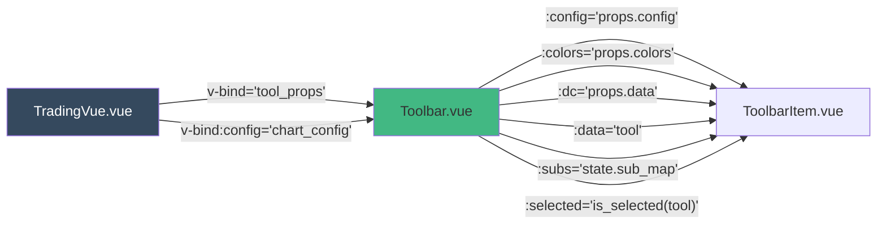
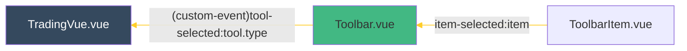

- use to render all tools on [Toolbar.vue](tutorial-Toolbar-vue.html)

### parent component
- [Grid.vue](#)

### child component
- [ToolbarItem.vue](tutorial-ToolbarItem-vue.html)


### state variable
|state|type|default|pass to child|
|--|--|--|--|
|tool_count|number|0||
|sub_map|object|{}||

### props received

|name|type|pass to child|
|--|--|--|
|data|Object|[ToolbarItem.vue](tutorial-ToolbarItem-vue.html), as `item` from `data.items`|
|height|number||
|colors|Object|[ToolbarItem.vue](tutorial-ToolbarItem-vue.html) as is|
|config|object|[ToolbarItem.vue](tutorial-ToolbarItem-vue.html) as is|


### event emitted

|event name|purpose|
|--|--|
|'item-selected'| pass selected value `item` in `items` props back to [Toolbar.vue](tutorial-Toolbar-vue.html)|

```html

<template>
    <div :class="['trading-vue-tbitem', selected ? 'selected-item' : '']"
        @click="emit_selected('click')"
        @mousedown="mousedown"
        @touchstart="mousedown"
        @touchend="emit_selected('touch')"
        :style="item_style">
        <div class="trading-vue-tbicon tvjs-pixelated"
            :style="icon_style">
        </div>
        <div class="trading-vue-tbitem-exp" v-if="data.group"
            :style="exp_style"
            @click="exp_click"
            @mousedown="expmousedown"
            @mouseover="expmouseover"
            @mouseleave="expmouseleave">
            ᐳ
        </div>
        <item-list :config="props.config" :items="props.data.items"
            v-if="show_exp_list" :colors="props.colors" :dc="props.dc"
            @close-list="close_list"
            @item-selected="emit_selected_sub"/>
    </div>
</template>

<script setup>
import {ref, computed, onMounted} from 'vue'
import ItemList from '@components/ItemList.vue'
import Utils from '@stuff/utils.js'

/**
 * @constant state-var
 */
const exp_hover = ref(false)
const show_exp_list = ref(false)
const sub_item = ref(null)
const click_start = ref(null) // timestamp
const click_id = ref(null)

/**
 * @constant props
 */
const props = defineProps({
    config:Object,
    data:Object,
    dc:Object,
    colors:Object,
    selected:Object,
    tv_id:Object,
    subs:Object
})

/**
 * emitter
 * @constant emit
 */
const emit = defineEmits(['item-selected']);

// methods
/**
 * @function mousedown
 * @desc seperate click and click-hold activity
 */
const mousedown = (e) => {
    click_start.value = Utils.now();
    click_id.value = setTimeout(() => {show_exp_list.value = true}, props.config.TB_ICON_HOLD)
}

const expmouseover = () => {exp_hover.value = true}
const expmouseleave = () => {exp_hover.value = false}
const expmousedown = (e) => {if (show_exp_list.value) e.stopPropagation()}
const emit_selected = (src) => {
    if (Utils.now() - click_start.value > props.config.TB_ICON_HOLD) return
    clearTimeout(click_id.value)
    //if (Utils.is_mobile && src === 'click') return
    // TODO: double firing
    if (!props.data.group) {
        emit('item-selected', props.data)
    } else {
        let item = sub_item.value || props.data.items[0]
        emit('item-selected', item)
    }
}

const emit_selected_sub = (item) => {
    emit('item-selected', item)
    sub_item.value = item
}

const exp_click = (e) => {
    if (!props.data.group) return
    e.cancelBubble = true
    show_exp_list.value = !show_exp_list.value
}

const close_list = () => {
    show_exp_list.value = false
}

// computed
const item_style = computed(()=> {
            // if (props.data.type === 'System:Splitter') {
            //     return this.splitter // splitter spcific css, which is ?
            // }
            let conf = props.config
            let im = conf.TB_ITEM_M
            let m = (conf.TOOLBAR - conf.TB_ICON) * 0.5 - im
            let s = conf.TB_ICON + im * 2
            let b = exp_hover.value ? 0 : 3
            return {
                'width': `${s}px`,
                'height': `${s}px`,
                'margin': `8px ${m}px 0px ${m}px`,
                'border-radius': `3px ${b}px ${b}px 3px`
            }
        }
)

const icon_style = computed(() => {
            if (props.data.type === 'System:Splitter') {
                return {}
            }
            let conf = props.config
            let br = conf.TB_ICON_BRI
            let sz = conf.TB_ICON
            let im = conf.TB_ITEM_M
            let ic = sub_item.value ? sub_item.value : props.data.icon
            return {
                'background-image': `url(${ic})`,
                'width': `${sz}px`,
                'height': `${sz}px`,
                'margin': `${im}px`,
                'filter': `brightness(${br})`
            }
        }
)

const exp_style = computed(() => {
            let conf = props.config
            let im = conf.TB_ITEM_M
            let s = conf.TB_ICON * 0.5 + im
            let p = (conf.TOOLBAR - s * 2) / 4
            return {
                padding: `${s}px ${p}px`,
                transform: show_exp_list.value ?
                    `scale(-0.6, 1)` :
                    `scaleX(0.6)`
            }
        }
)

const splitter = computed(() => {
            let conf = props.config
            let colors = props.colors
            let c = colors.grid
            let im = conf.TB_ITEM_M
            let m = (conf.TOOLBAR - conf.TB_ICON) * 0.5 - im
            let s = conf.TB_ICON + im * 2
            return {
                'width': `${s}px`,
                'height': '1px',
                'margin': `8px ${m}px 8px ${m}px`,
                'background-color': c
            }
        }
)

// life-cycle hook
/**
 * @name onmount
 */
onMounted(()=>{
if (props.data.group) {
    let type = props.subs[props.data.group]
    let item = props.data.items.find(x => x.type === type)
    if (item) sub_item.value = item
}
})

// export default {name: 'ToolbarItem'}
</script>

<style>

/**
.trading-vue-tbitem {
}
 */

.trading-vue-tbitem:hover {
    background-color: #76878319;
}

.trading-vue-tbitem-exp {
    position: absolute;
    right: -3px;
    padding: 18.5px 5px;
    font-stretch: extra-condensed;
    transform: scaleX(0.6);
    font-size: 0.6em;
    opacity: 0.0;
    user-select: none;
    line-height: 0;
}

.trading-vue-tbitem:hover
.trading-vue-tbitem-exp {
    opacity: 0.5;
}

.trading-vue-tbitem-exp:hover {
    background-color: #76878330;
    opacity: 0.9 !important;
}

.trading-vue-tbicon {
    position: absolute;
}
.trading-vue-tbitem.selected-item > .trading-vue-tbicon,
.tvjs-item-list-item.selected-item > .trading-vue-tbicon {
     filter: brightness(1.45) sepia(1) hue-rotate(90deg) saturate(4.5) !important;
}
.tvjs-pixelated {
    -ms-interpolation-mode: nearest-neighbor;
    image-rendering: -webkit-optimize-contrast;
    image-rendering: -webkit-crisp-edges;
    image-rendering: -moz-crisp-edges;
    image-rendering: -o-crisp-edges;
    image-rendering: pixelated;
}

</style>

```